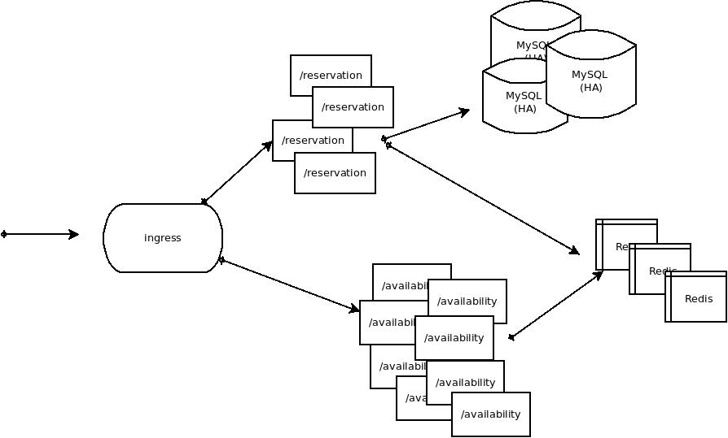

# campsite_tech_challenge

# Campsite
- [Docs](docs/): see /docs/ for specifications
- [Demo](docs/demo.mp4): Api Demo video


#### Requeriments

- docker
- jdk 11
- K6: To run stress tests (https://k6.io/)  (https://k6.io/docs/getting-started/installation) 

# API Implementation

## Test Coverage Report
````
./test.sh 
````


## Docker servers setup
 First you have execute:
```
./setup.sh
```
 This script starts a new MySQL instance on localhost:30306 with admin user/pass: root/root_pass  and a REDIS server in localhost:6379


#### MySQL start/stop

 After setup is done you can start/stop MySQL server using the commands:

```
docker stop mysqlCampsite
docker start mysqlCampsite
```
#### REDIS start/stop

 After setup is done you can start/stop REDIS server using the commands:

```
docker start redisCampsite
docker stop redisCampsite
```


## Running the service

````
./run.sh
````
Campsite service should be available at port 8080

### API check 

This curl must return HTTP 200 if the service has started ok.

````
curl -I -s -L 'http://0.0.0.0:8080/availability' | grep "HTTP/1.1"
````
expected result is:
    
````
HTTP/1.1 200 OK
````


### SWAGGER doc:

http://localhost:8080/swagger/views/swagger-ui/


## Running the stress test

````
./k6_tests/stress_test.sh 
````
This script starts a K6 test that get the availability report from localhost:8080.
Uses up to 100 "Virtual Users" concurrently and continually hitting the API.


# Design


The trade-off is to penalizing reservations/cancellations/updates operations in order to improve availability check operation response times. (availability DB data is cached in REDIS, so every INSERT/UPDATE/DELETE has to  some extra effort in order to maintain the cache consistent)

All availability services hits REDIS cache exclusively.  Report and Reservations vacancy checks are done using REDIS data to speed-up the response.

DB is used as last-line constraints keeper. Concurrent requests checks could fail in that case, so the DB constraints ensures consistency.

### Scalability

This is an example of how this solution can be scaled:
#### Development


#### Production


